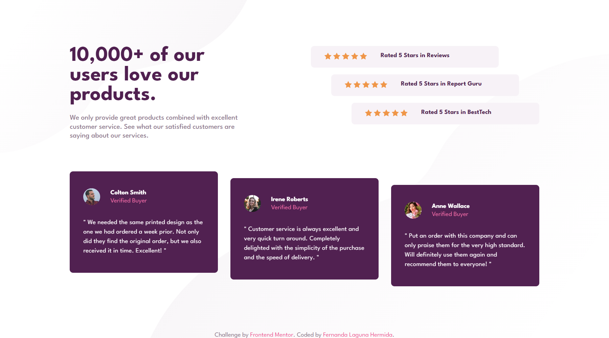
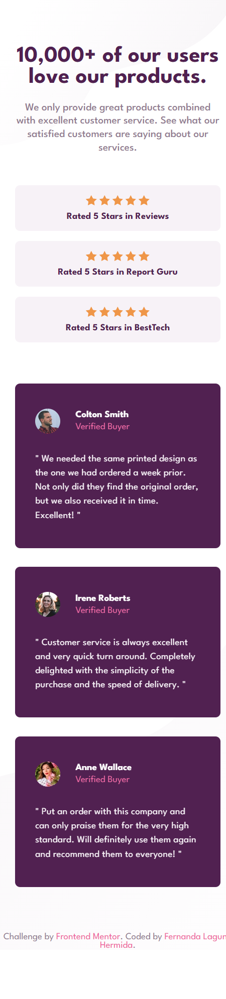

# Frontend Mentor - Social proof section solution

This is a solution to the [Social proof section challenge on Frontend Mentor](https://www.frontendmentor.io/challenges/social-proof-section-6e0qTv_bA). Frontend Mentor challenges help you improve your coding skills by building realistic projects. 

## Table of contents

- [Overview](#overview)
  - [The challenge](#the-challenge)
  - [Screenshot](#screenshot)
  - [Links](#links)
- [My process](#my-process)
  - [Built with](#built-with)
  - [What I learned](#what-i-learned)
  - [Continued development](#continued-development)
  - [Useful resources](#useful-resources)
- [Author](#author)

## Overview

### The challenge

Users should be able to:

- View the optimal layout for the section depending on their device's screen size

### Screenshot

### Links

- Solution URL: [Add solution URL here](https://your-solution-url.com)
- Live Site URL: https://ferlagher.github.io/FMC-Social-proof-section

## My process

### Built with

- Semantic HTML5 markup
- Sass ♥
- Flexbox
- CSS Grid
- BEM

### What I learned

I'm trying to get used to BEM methodology, but some times I feel it's *contraintuitive*. (I'm not sure if this is a word in english...)

### Continued development

Next challenge: [Four card feature section](https://www.frontendmentor.io/challenges/four-card-feature-section-weK1eFYK)
### Useful resources

- [How To Nest Blocks Within Blocks in BEM](https://scalablecss.com/bem-blocks-within-blocks/)
- [BEM Grandchildren: How To Handle Deeply Nested Elements](https://scalablecss.com/bem-nesting-grandchild-elements/)
- [MindBEMding – getting your head ’round BEM syntax](https://csswizardry.com/2013/01/mindbemding-getting-your-head-round-bem-syntax/)

## Author

- LinkedIn - [ferlagher](https://www.linkedin.com/in/ferlagher/)
- Frontend Mentor - [@ferlagher](https://www.frontendmentor.io/profile/ferlagher)
- Instagram - [@ferlagher](https://www.instagram.com/ferlagher/)

Thank you very much for reading. ♥
